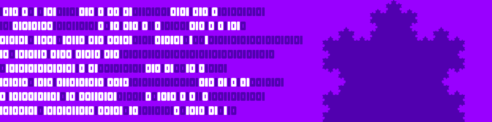

### Hey, what's up 👋

# You are looking at Mabz's GitHub page

## Mabz is...
a computer science and mathematics student at UMass, Amherst who codes in the Unity game engine in his free time. I first started programming on the [Scratch](https://scratch.mit.edu/users/MabzTheGameMaker/) website where I learned how to make games and in doing so learned some introductory programming concepts. I continued learning about ideas in computer science through self teaching as well as in computer science classes in high school including AP computer science. I continue my computer science education at UMass, Amherst where I major in computer science and mathematics. Outside of school I occasionally work on projects in Unity using C# for fun as well as to improve my coding abilities.

## Currently Working On...
a video editor software to construct animations and visualizations using Unity (I am aware that Unity probably isn't the best framework for this type of project, but I am familiar with Unity and it works good enough for my desires). In this software I take elements, which are sprites or text, and apply actions to the elements that have the capabilities of moving, scaling, rotating, recoloring, and transforming. The animations are generated by coding the animation behaviors directly or by editing the values of preconstructed elements. In play mode there are GUI elements used to play/pause, fast forward, skip, rewind, and scroll through the animation of the video. I am currently working to create a video full of animations and visualizations to test the capabilities and workflow process in using the application.
